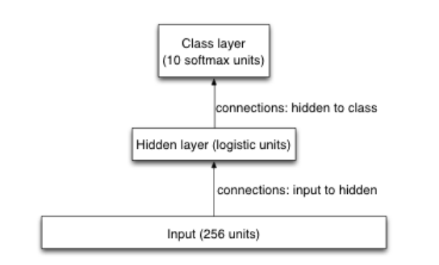

# Assignment 3: Optimization and Generalization

## Introduction

In this assignment, you're going to train a simple Neural Network, for recognizing handwritten digits. You'll be programming, looking into efficient optimization, and looking into effective regularization.

The dataset for this assignment is the USPS collection of handwritten digits. It consists of scans (images) of digits that people wrote. The input is a 16 by 16 image of greyscale pixels, showing an image of a handwritten digit. The output is simply which of the 10 different digits it is, so we're using a 10-way softmax as the output layer of our Neural Network. The input layer is simply 256 units, i.e. one for each pixel. We use one hidden layer of logistic units. One of the issues we'll be investigating is what number of hidden units works best for generalization. To keep things as simple as possible, we're not including biases in our model. In the diagram you can see that this model is significantly simpler than the model that we used in programming assignment 2.

In this assignment, we're mostly interested in the cross-entropy error, as opposed to the classification error rate. The reason for that is that the cross-entropy error is continuous and behaves better than the classification error rate. Only at the very end will we look at the classification error rate.To investigate generalization, we need a training set, a validation set, and a test set, so the dataset has been split in 3 groups. We train our networks on the training set; we use the validation set to find out what's generalizing well and what isn't; and after we've made our choice of regularization strategy, we'll see how well our model performs on the test set. Those three subsets have already been made for you, and you're not expected to change them (you're not even allowed to change them). The full USPS dataset has 11,000 images. We're using 1,000 of them as training data, another 1,000 as validation data, and the remaining 9,000 as test data. Normally, one would use most of the data as training data, but for this assignment we'll use less, so that our programs run more quickly.Before we get to the issue of generalization, we need a good optimization strategy. The optimizer that we're using is gradient descent with momentum, but we'll need to find good values for the learning rate and the momentum multiplier.

## Questions

2. What is the loss on the training data for that test run? Write your answer with at least 5 digits after the decimal point.
3. Programming:
  * Implement weight decay error first
    * Run with a huge weight decay `lambda`
    * Weight decay overshadows the classification loss
    * Gradient check it
  * Turn off weight decay - `lambda = 0`
  * Implement classification loss gradient
3. Let's do an initial run with with learning rate 0.005 and no momentum: run a3(0, 10, 70, 0.005, 0, false, 4)
  * What is the training data loss that that run reports at the end? Use at least 5 digits after the decimal point.
  * `2.303441`
4. Was the best run a run with momentum or without momentum?
  * The best of those 14 runs was with momentum.
5. What was the learning rate for the best of those 14 runs?
  *  `a3(0, 10, 70, 0.2, 0.9, false, 4) => 0.2`
6. What is the validation data classification loss now? Write your answer with at least 5 digits after the decimal point.
  * validation data classification loss: `0.430185`
7. What is the validation data classification loss now, i.e. with early stopping?
  * validation data classification loss: `0.334505`
8. Run additional experiments with the other WD coefficients listed below, and indicate which of them gave the best generalization. Be careful to focus on the classification loss (i.e. without the weight decay loss), as opposed to the final loss (which does include the weight decay loss).
  * `a3(0.0001, 200, 1000, 0.2, 0.9, false, 100)`: `0.0001`
    * classification loss (without weight decay) on the validation data is `0.358581`
  * `0.001`
    * classification loss (without weight decay) on the validation data is `0.277952`
  * `0.01`
    * classification loss (without weight decay) on the validation data is `0.512263`
  * `0`
    * classification loss (without weight decay) on the validation data is `0.405013`
  * `1`
    * classification loss (without weight decay) on the validation data is `2.302585`
  * `5`
    * classification loss (without weight decay) on the validation data is `2.302585`
9. Turn off the weight decay, and instead try the following hidden layer sizes. Indicate which one worked best.
  * `a3(0, 10, 1000, 0.2, 0.9, false, 100): 10`
    * classification loss on the validation data is `0.107000`
  * `30`
    * classification loss on the validation data is `0.082000`
  * `100`
    * classification loss on the validation data is `0.083000`
  * `130`
    * classification loss on the validation data is `0.089000`
  * `170`
    * classification loss on the validation data is `0.084000`
10. Most regularization methods can be combined quite well. Let's combine early stopping with a carefully chosen hidden layer size. Which number of hidden units works best that way, i.e. with early stopping? Remember, best, here, is based on only the validation data loss.
  * `a3(0, 18, 1000, 0.2, 0.9, true, 100): 18`
    * classification loss on the validation data is `0.289369`
  * `37`
    * classification loss on the validation data is `0.264666`
  * `83`
    * classification loss on the validation data is `0.306714`
  * `113`
    * classification loss on the validation data is `0.318307`
  * `236`
    * classification loss on the validation data is `0.357150`
11. For the settings that you chose on the previous question, what is the test data classification error rate?
  * ` a3(0, 37, 1000, 0.2, 0.9, true, 100)`
    * Test data classification error rate: `0.083000`
